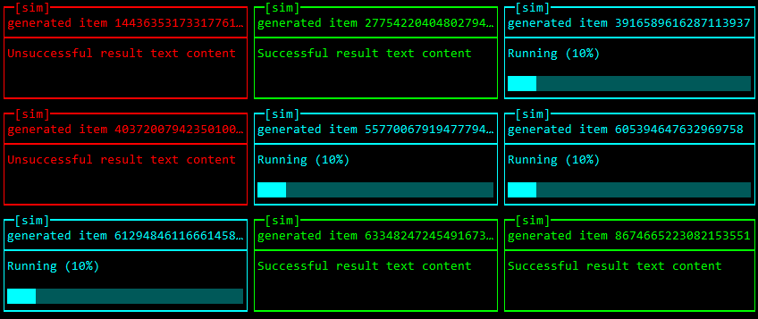

dashboard
=========

Dashboard app for Raspberry Pi



Arhitechture
------------

**Dashboard** consists of the following components:

* [**dashd**](/daemon/README.md) - a backend service running as a daemon
* [**dasht**](/terminal/README.md) - a terminal client app that connects to **dashd**

Data providers
--------------

**Dashboard** supports different data providers:

* [`sim`](/providers/sim/README.md)
* [`ping`](/providers/ping/README.md)
* [`mongodb`](/providers/mongodb/README.md)
* [`teamcity`](/providers/teamcity/README.md)


Compile
-------

### Prerequisites

* You will need a Go 1.5+ installed into your PATH
* You will need a git client installed into your PATH

### Compile on Linux

Run command

```bash
./build.sh
```

to compile **dashboard** for your OS.

To cross-compile use commands like

```bash
./build.sh windows 386
./build.sh windows amd64
./build.sh linux 386
./build.sh linux amd64
./build.sh linux arm
```

### Compile on Windows

Run command

```cmd
build.cmd
```

to compile **dashboard** for your OS.

To cross-compile use commands like

```cmd
build.cmd windows 386
build.cmd windows amd64
build.cmd linux 386
build.cmd linux amd64
build.cmd linux arm
```

Install
-------

Here is a short guide how to get **dashboard** up and running on a Raspberry Pi:

1. Define a couple of enviroment variables (add the following lines into the `~/.profile`):

```bash
# $DASH_DIR is a directory containing dashboard files - binaries, config and logs
export DASH_DIR=/home/pi/dashboard
# $DASH_PORT is a port number for dashd
export DASH_PORT=8000
export PATH=$PATH:$DASH_DIR
```

2. Copy files `dashd`, `dasht`and `dashctl` into `DASH_DIR`

```bash
mkdir -p $DASH_DIR

cp dashd $DASH_DIR/dashd
cp dasht $DASH_DIR/dasht
cp dashctl $DASH_DIR/dashctl

chmod +x $DASH_DIR/dashd
chmod +x $DASH_DIR/dasht
chmod +x $DASH_DIR/dashctl
```

3. Create configuration file `dashd.json`:

```bash
touch $DASH_DIR/dash.json
echo "[]" >> $DASH_DIR/dash.json
```

4. Define neccessary providers in `dash.json`

5. Add the following script into `~/.profile`:

```bash
export DASH_DIR=/home/pi/dashboard
export DASH_PORT=8000
export PATH=$PATH:$DASH_DIR

if [[ $(tty) == "/dev/tty1" ]]; then
  dashctl start
fi

dashctl terminal
```

Using dashctl script
--------------------

Script `dashctl` provides the following commands:

1. Start a background **dashd** process:

```bash
dashctl start
```

2. Stop a background **dashd** process:

```bash
dashctl stop
```

3. Restart a background **dashd** process:

```bash
dashctl restart
```

4. Start a foreground **dasht** process:

```bash
dashctl terminal
```